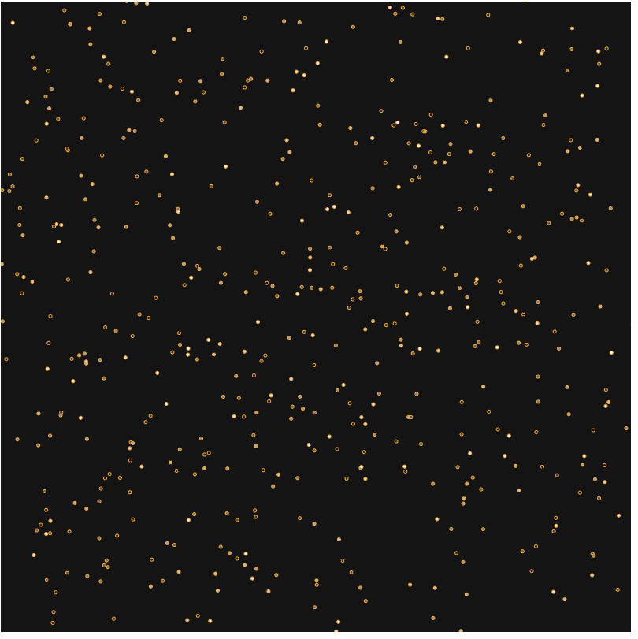

# Popcorn
---

---
Initial output of playing with P5.js and experimenting with workflows. 

Each dot starts at maximal 255 value and decays
at a set rate for each time step t. Once they reach a minimal threshold, they "pop".
When a dot pops it is moved in a random direction and resets the interior fill of 
the dot. 

